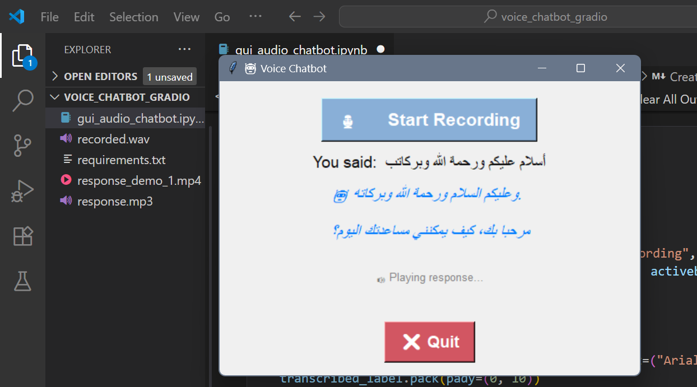

# 🎙️ Voice Chatbot using Whisper & Cohere

An AI-powered voice chatbot that listens to your voice, transcribes it using **OpenAI Whisper**, generates intelligent responses using **Cohere's command-r** model, and speaks the response using **gTTS** — all via a simple GUI built with **Tkinter**.


---
## 🚀 Features

🎤 Voice Recording (5 seconds)

🧠 Speech-to-Text using Whisper

💬 AI Response Generation using Cohere's command-r model

🔊 Text-to-Speech using gTTS

🖥️ User-Friendly GUI using Tkinter

---

## 🧱 Requirements

- Install the required libraries:

```bash
pip install -r requirements.txt
```
- Or install manually:
  
```bash
pip install openai-whisper sounddevice scipy cohere gTTS playsound

```
---
## 🔧 How to Run

1- Replace **`"YOUR_API_KEY"`** with your actual [Cohere API key](https://dashboard.cohere.com/api-keys).

2- Run the script:
```bash
python voice_chatbot.py

```
3- Click the **"🎙️ Start Recording"** button to begin speaking.

4- The chatbot will listen → transcribe → respond → speak back.


---

## 📝 Notes

- Make sure your microphone and speakers are working.

- Temporary audio files ( `recorded.wav `, `response.mp3`) are deleted after each interaction.

- Response generation uses Cohere's `chat()` function with the `command-r` model.

---

## 🧠 Powered By

- [OpenAI Whisper](https://github.com/openai/whisper)

- [Cohere](https://cohere.com/)

- [gTTS](https://pypi.org/project/gTTS/)

- [Tkinter](https://docs.python.org/3/library/tkinter.html)

  ---

## 🎥 Example Outputs

Here are sample outputs demonstrating how the chatbot responds to spoken input:

### 📸 GUI Screenshot


### 📹 Demo Video
[▶️ Click to watch the demo response video](./response_demo_1.mp4)

> Note: GitHub doesn't support inline video playback in README files. Click the link above to download or play the demo video.
